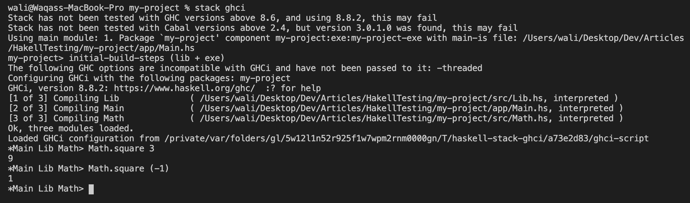
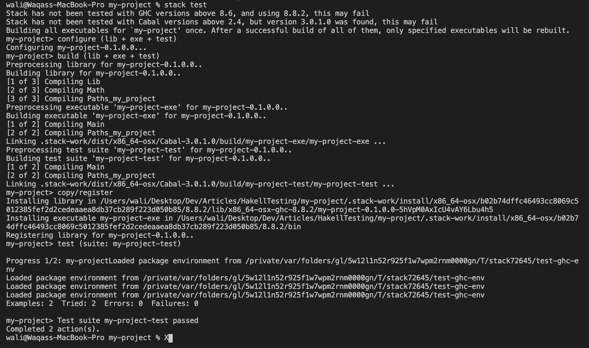

If you want to easily test your functions in Haskell, you can do so by writing inputs and their expected responses right above your functions as comments. All you need is [doctest](https://github.com/sol/doctest).

This is how:

### 1. Setup Project

Let's setup a basic project first.

1. Install [Haskell Stack](https://docs.haskellstack.org/en/stable/README/#how-to-install) if you don't have it already.

2. Setup project and install required dependencies.

```
stack new my-project
cd my-project
stack setup
```

3. Build and execute project. If you see `someFunc` in the output you are good to go.

```
stack build
stack exec my-project-exe
```


### 2. Write a function

Let's write a simple function so we can test it.

1. Create a file `Math.hs` in `src` with a `square` function:

```
module Math where

square :: Int -> Int
square x = x * x
```

2. Manually test the function in [GHCi](https://wiki.haskell.org/GHC/GHCi). Load up the interactive environment using `stack ghci`.

3. Try out the function to see everything is working as expected: `Math.square 3` should output `9`.



### 3. Write tests

Now let's get to the actual testing. All we need to do to is write comments.

1. Just above your function definition, write your set of inputs and their expected outputs. This is how my `Math.hs` looks like:

```
module Math where

-- | Square numbers
--
-- Examples:
--
-- >>> square 3
-- 9
--
-- >>> square (-1)
-- 1
square :: Int -> Int
square x = x * x
```

2. If you try running `stack test` you will notice these tests don't run. That's because we haven't set up `doctest` yet.

### 4. Configure Project for doctest

1. First, let's add `doctest` to our project. Go to the end of `package.yaml` and add it as dependency of `my-project-test`. This is how my `package.yaml` looks like:

```
name:                my-project
version:             0.1.0.0
github:              "githubuser/my-project"
license:             BSD3
author:              "Author name here"
maintainer:          "example@example.com"
copyright:           "2020 Author name here"

extra-source-files:
- README.md
- ChangeLog.md

# Metadata used when publishing your package
# synopsis:            Short description of your package
# category:            Web

# To avoid duplicated efforts in documentation and dealing with the
# complications of embedding Haddock markup inside cabal files, it is
# common to point users to the README.md file.
description:         Please see the README on GitHub at <https://github.com/githubuser/my-project#readme>

dependencies:
- base >= 4.7 && < 5

library:
  source-dirs: src

executables:
  my-project-exe:
    main:                Main.hs
    source-dirs:         app
    ghc-options:
    - -threaded
    - -rtsopts
    - -with-rtsopts=-N
    dependencies:
    - my-project

tests:
  my-project-test:
    main:                Spec.hs
    source-dirs:         test
    ghc-options:
    - -threaded
    - -rtsopts
    - -with-rtsopts=-N
    dependencies:
    - my-project
    - doctest
```

2. To install the dependency, run `stack test`. If the installation goes well, you should see the following message `Test suite not yet implemented`.


If you go to the actual test file in `test/Spec.hs` you can see that there indeed are no tests. We need to somehow tell stack to look for tests in our `src` files instead.

3. To do that, clear the contents of `test/Spec.hs` file and replace it with this:

```
import Test.DocTest

main = doctest ["-isrc", "src/Math.hs"]
```

4. Now, if you run `stack test` it will run the 2 tests we wrote earlier. That's it, we are done!



When you add more modules, simply add them to this list `["-isrc", "src/Math.hs"]` in `test/Spec.hs` to make `doctest` look for tests in them.

### Note

This was my setup while writing this:

- MacOS `10.15.3`
- Haskell Stack `2.1.3`
