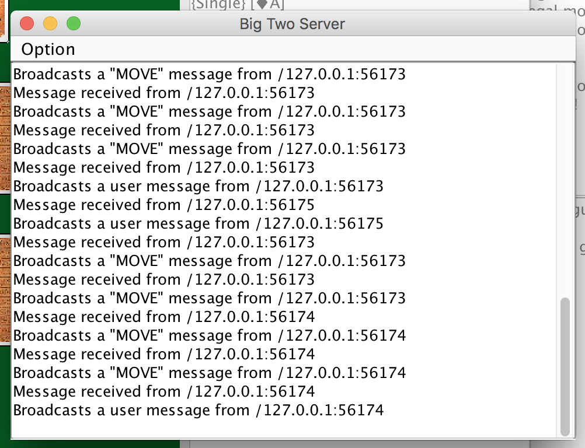

A full-featured multiplayer networked card game made in Java.

## Screenshots

## Links

- [GitHub](http://github.com/WaqasAliAbbasi/BigTwo)

## Design

1.  OOP(Object Oriented Programming) approach to conveniently handle complex game mechanics and rules
2.  Java GUI for the client
3.  Proper use of exceptions for error handling
4.  Multi-threaded approach to handle networking
5.  Java Sockets to handle network multiplayer
6.  Proper comments and documentation has been made for all classes and methods

## Game rules

The basis of Big Two is a race to get rid of your cards. Read more [here](https://en.wikipedia.org/wiki/Big_two).
