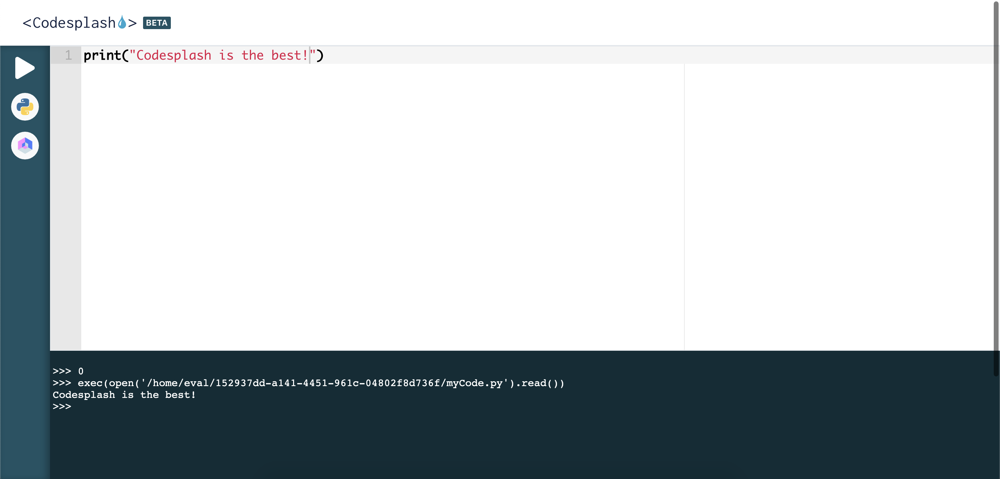

Collaborative online IDE launched to support STEM education initiatives at The University of Hong Kong.

## Links

- [codesplash.app](https://codesplash.app)

## Technical Details

- Fully TypeScript
- React on Frontend, Express.js on Backend
- GraphQL Server (Apollo Server)
- GraphQL Client (Apollo Client)
- Containerization (Docker)
- Content Delivery Network (DigitalOcean)
- Web Sockets (Socket.io)

## Team

- [Ahsan Syed](https://www.linkedin.com/in/ahsan-syed-930a2014a/)
