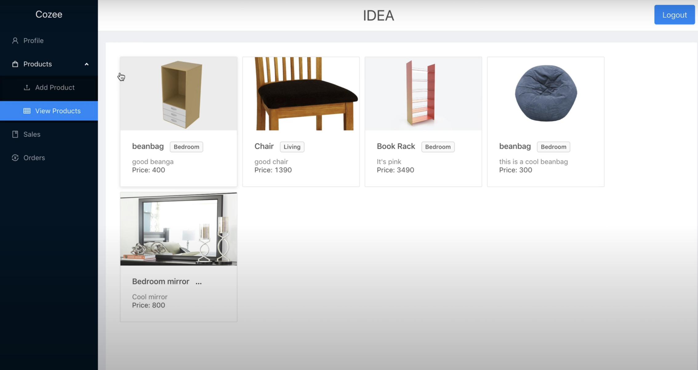

A web and a mobile app aimed at reducing an online furniture buyer’s confusion using augmented reality. Hackathon
project made in 36 hours. Seamless display integration between mobile and web app using Redux. Placing 3D renders
of furniture items in a room using Augmented Reality. Attempted 3D model generation using 2D images.

## Links

- [Github](https://github.com/uday1331/cozee)
- [Demo](https://drive.google.com/drive/folders/115TJLFX-8QETlk1O_PkLkinO-jxkv2ZL)

## Team

- [Ahsan Syed](https://www.linkedin.com/in/ahsan-syed-930a2014a/)
- [Welvin bun](https://www.linkedin.com/in/welvin-bun/)
- [Manya Agarwal](https://www.linkedin.com/in/manyaagarwal/)
- [Diabul Haque](https://www.linkedin.com/in/diabhaque/)
