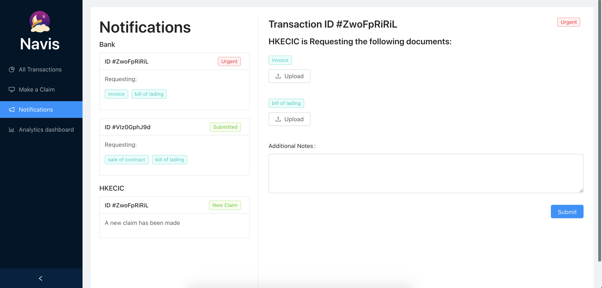

An award winning hackathon project made tailored to client’s needs of reducing paperwork in the insurance industry to
improve buyer-seller compliance.Provided solution in the form of SaaS with MVP as a functioning web app.

## Links

- [navis-app.app](https://navis-app.co)
- [Github](https://github.com/welvin21/navis)

## Team

- [Ahsan Syed](https://www.linkedin.com/in/ahsan-syed-930a2014a/)
- [Welvin bun](https://www.linkedin.com/in/welvin-bun/)
- [Sean Chok](https://www.linkedin.com/in/sean-chok-9035b2144/)
- [Adrio Alimin](https://www.linkedin.com/in/adrio-alimin-8b5343152/)
- [Diabul Haque](https://www.linkedin.com/in/diabhaque/)
