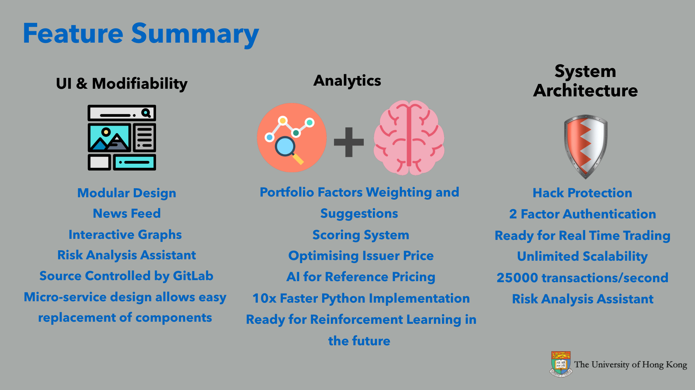
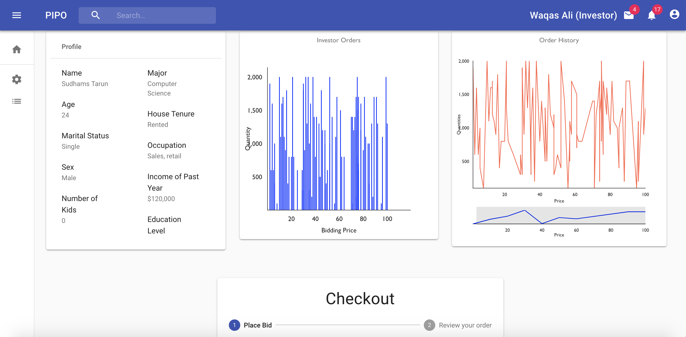
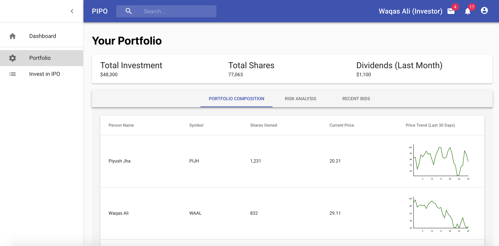
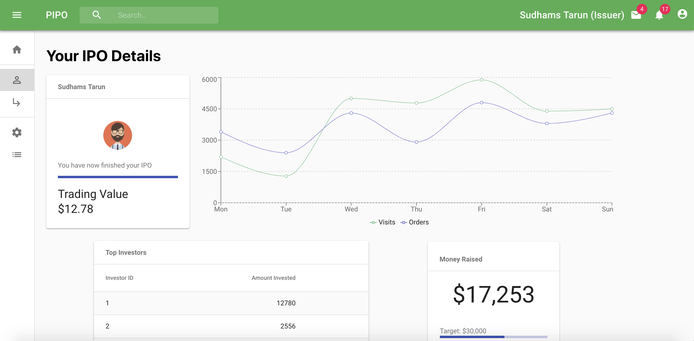

You may be familiar with the concept of a company raising capital by an initial public offering (IPO). PIPO takes this capital-raising concept and applies it to individuals.

Imagine having a personal IPO market for people who want to raise money by offering their personal shares and people who want to invest in them, especially friends and family. Through “dividend” payments, the investors of PIPO earn a share from the income of people they invest in.

PIPO is a functional primary market exchange platform prototype that offers valuation and deal making for personal IPO investors.

## Links

- [GitHub](https://github.com/WaqasAliAbbasi/Chengdu80-HKU)

## Competition

Hosted by [Southwestern University of Finance and Economics](https://e.swufe.edu.cn/) in Chengdu (Sichuan, China) over a span of 6 days, **Chengdu80 2018** was an international inter-university fintech design and development competition. 8 universities including UC Berkley, National University of Singapore and University of Hong Kong participated in it.

## Awards

Came **Runner-up** and won a prize money of **30,000 RMB**.

## Team

HKU PIPO was developed at **Chengdu80 2018** over a course of 80 hours from **31 October to 3 November 2018** by the following team from University of Hong Kong:

1.  Chan Chun Fai
2.  [Piyush Jha](https://www.linkedin.com/in/piyush-jha/)
3.  [Waqas Ali](https://waqasaliabbasi.com/)
4.  [Tarun Sudhams](https://www.linkedin.com/in/tarun-sudhams-560a6815a/)
5.  Anushka Vashishtha
6.  Saksham Arora

## Pitch

<embed src="https://drive.google.com/viewerng/
viewer?embedded=true&url=https://github.com/WaqasAliAbbasi/Chengdu80-HKU/raw/master/Chengdu%2080%20Final%20Pitch.pdf" width="250"/>

## Tech

### Front-end

- React
- Redux
- Material-UI
- Redux Thunk
- Victory (Data Visualization)

### Back-end

- Python
- Django

### Machine Learning

- Random Forest Classifier

## Screenshots

