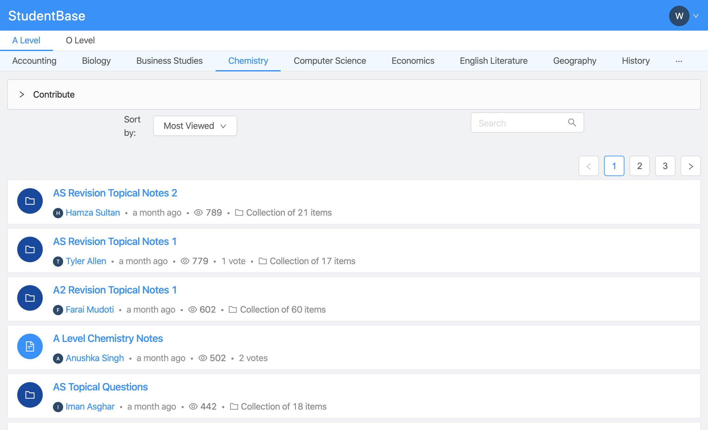

A platform for high school students to share useful resources with each other. Released on January 11, 2020, it has 10k monthly users and 100k monthly page views (as of February 16, 2020).

## Links

- [StudentBase.app](https://studentbase.app)
- [On Facebook](https://fb.me/StudentBaseApp)

## Technical Details

- Fully TypeScript
- React on Frontend, Express.js on Backend
- GraphQL Server (Apollo Server)
- GraphQL Client (Apollo Client)
- Infrastructure as Code (Terraform with DigitalOcean)
- Containerization (Docker)
- Content Delivery Network (DigitalOcean)
- S3 Content Storage (DigitalOcean Spaces)
- HTTPS (Let's Encrypt)
- 95% Testing Coverage
- Caching to external services (node-cache)
- Email and Facebook Authentication
- Continuous Integration/Deployment (GitHub Actions)
- Automated Backups
- Multiple environments (Production, Staging)
- A/B Testing
- Dynamic Sitemap Generation
- Google Analytics to track behavior
- Integration with Google Analytics to show item views

## Team

- [Ahsan Syed](https://www.linkedin.com/in/ahsan-syed-930a2014a/)
- [Uday Jain](https://www.linkedin.com/in/uday-jain-862a40174/)
